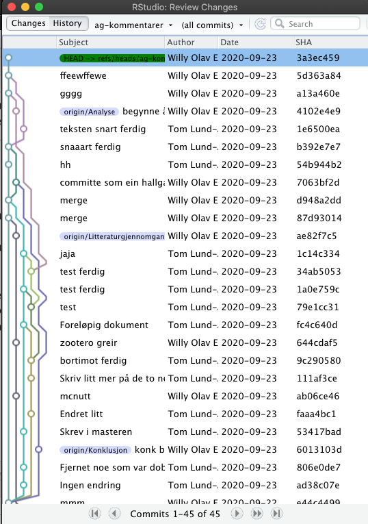

1) Genererer docx, pdf og html uten problemer. Bra!
2) cite ser ut til å virke. Bra!
2) Bruk "in text" varianten av cite kommandoen riktig. Se mitt forslag
3) Rettet en liten feil i bib filen (Ignoring entry ‘riederer’ (line627) because: 
	The name list field author cannot be parsed)
4) La inn bilde av commit historien

5) La inn `

` for å få referansene før appendiks
6) Dere burde tatt en `sessionInfo` i Console hos den siste som kjørte dokumentet og så limt output inn i appendiks omringet av 3 backticks før å etter
7) slo på innhildsfortegnelse siden det er så lett å generere
